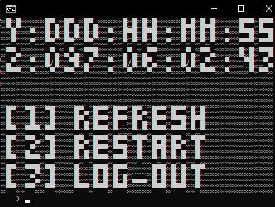
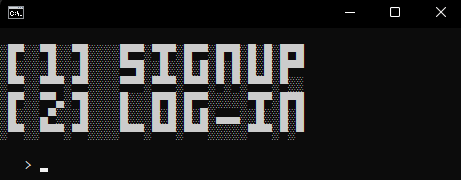

# addiction tracker

a tool written in python to keep track of addictions, urges, and relapses\

this is the **public** release. code will not function unless you add your *own* firebase realtime database url.

## features

- tracks time since relapse
- full account system
- stylized cli ui
- secures data
- lightweight
- & more

## about

**total lines of code:** 614 (as of last update)

**reason for making:** final project for cse

## screenshots





### install

1. clone or download this repo  
2. run the setup script:

```bash
./scripts/download.bat
```

this will auto-install any required stuff you need

### run

once installed, just launch it:

```bash
./Addiction-Tracker.bat
```

if it doesn't run, install requirements

## structure

```txt
addiction-tracker-main/
│
├── assets/                # app assets
├── loader/                # loader script
├── scripts/               # helper scripts (like download.bat)
├── src/                   # main code
├── tests/                 # test scripts for debugging & development
├── Addiction-Tracker.bat  # main file to launch app
├── LICENSE                # license
└── README.md              # this file
```

## disclaimer

password data saved in the databased is securely hashed via [argon2](https://en.wikipedia.org/wiki/Argon2)

## license

MIT License

Copyright (c) 2025 Jackson

Permission is hereby granted, free of charge, to any person obtaining a copy
of this software and associated documentation files (the "Software"), to deal
in the Software without restriction, including without limitation the rights
to use, copy, modify, merge, publish, distribute, sublicense, and/or sell
copies of the Software, and to permit persons to whom the Software is
furnished to do so, subject to the following conditions:

The above copyright notice and this permission notice shall be included in all
copies or substantial portions of the Software.

THE SOFTWARE IS PROVIDED "AS IS", WITHOUT WARRANTY OF ANY KIND, EXPRESS OR
IMPLIED, INCLUDING BUT NOT LIMITED TO THE WARRANTIES OF MERCHANTABILITY,
FITNESS FOR A PARTICULAR PURPOSE AND NONINFRINGEMENT. IN NO EVENT SHALL THE
AUTHORS OR COPYRIGHT HOLDERS BE LIABLE FOR ANY CLAIM, DAMAGES OR OTHER
LIABILITY, WHETHER IN AN ACTION OF CONTRACT, TORT OR OTHERWISE, ARISING FROM,
OUT OF OR IN CONNECTION WITH THE SOFTWARE OR THE USE OR OTHER DEALINGS IN THE
SOFTWARE.
